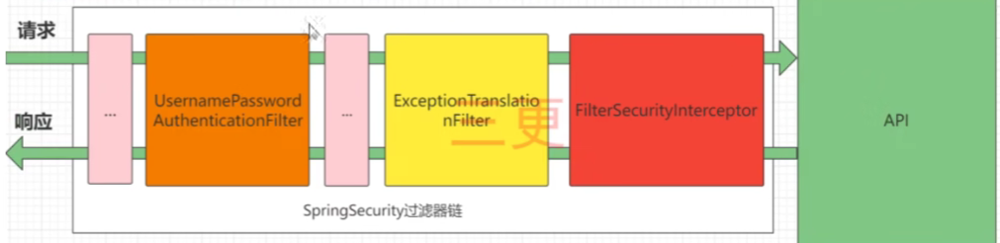
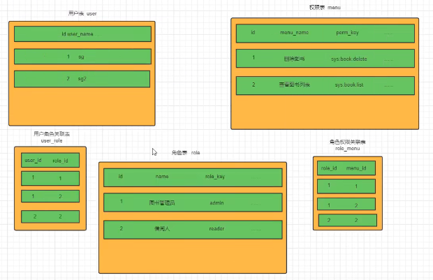

# 快速入门

## 1.1 准备工作

> 我们先搭建一个简单的SpringBoot工程
> > 1. 设置父工程 添加依赖

```xml

<parent>
    <groupId>org.springframework.boot</groupId>
    <artifactId>spring-boot-starter</artifactId>
    <version>2.5.0</version>
</parent>
<dependencies>
<dependency>
    <groupId>org.springframework.boot</groupId>
    <artifactId>spring-boot-starter-web</artifactId>
</dependency>
<dependency>
    <groupId>org.projectlombok</groupId>
    <artifactId>lombok</artifactId>
</dependency>
</dependencies>
```

## 引入SpringSecurity

> 在SpringBoot项目中使用SpringSecurity我们只需要引入依赖即可实现入门案例

```xml

<dependency>
    <groupId>org.springframework.boot</groupId>
    <artifactId>spring-boot-starter-security</artifactId>
</dependency>
```

> 引入以来后我们再尝试去访问之前的接口,就会自动跳转到一个SpringSecurity的默认登录页面,默认是user,密码会输出在控制台.
> 必须登录之后才能对接口进行访问

# 认证

## 2.1 登录校验流程


## 2.2 原理初探

> 想要知道如何实现自己的登录流程就必须要先知道入门案例中SpringSecurity的流程 SpringSecurity+JWT实现前后端分离认证

### 2.2.1 SpringSecurity 完整流程

> &nbsp;SpringSecurity 原理其实是一个过滤器链,内部包含了提供各种功能的过滤器.这里我们可以看看入门案例中的过滤器
>
>

> **UsernamePasswordAuthenticationFilter**:  负责处理我们在登陆页面填写了用户名密码后的登陆请求。入门案例的认证工作主要有它负责。  
> **ExceptionTranslationFilter** :处理过滤器链中抛出的任何`AccessDeniedException`和`AuthenticationException`。    
> **FilterSecuritylntercepto****r**:负责权限校验的过滤器。

> 我们可以查看SpringSecurity中的拦截器链


### 2.2.2 认证流程


> 概念速查:
> > 1. **Authentication接口**:它的实现类，表示当前访问系统的用户，封装了用户相关信息。
> >2. **AuthenticationManager接口**:定义了认证Authentication的方法
> >3. **UserDetailsService接口**:加载用户特定数据的核心接口。里面定义了一个根据用户名查询用户信息的方法。
> >4. **UserDetails接口**:提供核心用户信息。通过userDetailService根据用户名获取处理的用户信息要封装成UserDetails对象返回。然后将这些信息封装到Authentication对象中。


## 2.3 解决问题

### 2.3.1 思路分析

> 登录
> > 1. **自定义接口**: 调用ProviderManager的方法进行认证,如果认证通过生成JWT,把用户信息存入Redis中
> > 2. 自定义UserDetailService这个实现类去查询数据库

> 校验
> > 1. 定义JWT认证过滤器
> > > ①: 获取token  
> > > ②: 解析token获取其中的userId  
> > > ③: 从redis中获取用户信息  
> > > ④存入SecurityContextHolder

### 2.3.2 准备工作

```xml
<!--        redis依赖-->
<dependency>
    <groupId>org.springframework.boot</groupId>
    <artifactId>spring-boot-starter-data-redis</artifactId>
</dependency>
        <!--        fastJson-->
<dependency>
<groupId>com.alibaba</groupId>
<artifactId>fastjson</artifactId>
<version>1.2.33</version>
</dependency>
        <!--        jwt依赖-->
<dependency>
<groupId>io.jsonwebtoken</groupId>
<artifactId>jjwt</artifactId>
<version>0.9.0</version>
</dependency>
```

添加Redis相关配置

#### 2.3.3 实现

##### 2.3.3.1 数据库校验用户

> 1. UserServiceImpl.class 需要实现**UserDetailsService**接口,重写里面的`loadUserByUsername`方法,才能使用自己的数据库用户名密码登录
> 2. 重写该方法需要返回UserDetails对象,创建`CustomUserDetails`方法实现`UserDetails`方法,重写方法,并创建User对象作为该类的构造方法参数  
     > 核心代码:   
     > `service.UserServiceImpl.class`  `pojo.CustomUserDetails.class`

##### 2.3.3.2 密码加密存储

> 实际项目中我们不会把密码明文存储在数据库中。
>1. 默认使用的PasswordEncoder要求数据库中的密码格式为: (id}password。它会根据id去判断密码的加密方式。但是我们一般不会采用这种方式。所以就需要替换PasswordEncoder
>2. 我们一般使用SpringSecurity为我们提供的BCryptPasswordEncoder。
>3.
我们只需要使用把BCryptPasswordEncoder对象注入Spring容器中，SpringSecurity就会使用该PasswordEncoder来进行密码校验.我们可以定义一个SpringSecurity的配置类，SpringSecurity要求这个配置类要继承WebSecurityConfigurerAdapter。
代码实现
>1. 创建`config.SecurityConfig.class`继承`WebSecurityConfigurerAdapter`,在该类中创建PasswordEncoder类型的Bean

##### 2.3.3.3 登录接口

> 接下我们需要自定义登陆接口，然后让SpringSecurity对这个接口放行,让用户访问这个接口的时候不用登录也能访问。
> 在接口中我们通过`AuthenticationManager的authenticate`方法来进行用户认证,所以需要在SecurityConfig中配置把`AuthenticationManager`注入容器。  
> 认证成功的话要生成一个jwt，放入响应中返回。并且为了让用户下回请求时能通过jwt识别出具体的是哪个用户，我们需要把用户信息存入redis，可以把`用户id作为key`。

> 详情见`utils.JwtUtil.java`工具类

##### 2.3.3.4 认证过滤器

> 详情见`filter.JwtAuthenticationToken.java`

##### 2.3.3.5 退出登录

> 详情见`service.LoginServiceImpl.java`

# 3. 授权

## 3. 1 权限系统的作用

>
&nbsp;&nbsp;&nbsp;&nbsp;例如一个学校图书馆的管理系统，如果是普通学生登录就能看到借书还书相关的功能，不可能让他看到并且去使用添加书籍信息，删除书籍信息等功能。但是如果是一个图书馆管理员的账号登录了，应该就能看到并使用添加书籍信息，删除书籍信息等功能。  
&nbsp;&nbsp;&nbsp;&nbsp;总结起来就是不同的用户可以使用不同的功能。这就是权限系统要去实现的效果。  
&nbsp;&nbsp;&nbsp;&nbsp;我们不能只依赖前端去判断用户的权限来选择显示哪些菜单哪些按钮。因为如果只是这样，如果有人知道了对应功能的接口地
上就可以
不通过前端，直接去发送请求来实现相关功能操作。    
&nbsp;&nbsp;&nbsp;&nbsp;所以我们还需要在后台进行用户权限的判断，判断当前用户是否有相应的权限，必须基于所需权限才能进行相应的操作。

## 3.2 授权基本流程

> &nbsp;&nbsp;&nbsp;&nbsp;在SpringSecurity中，会使用默认的`FilterSecurityinterceptor`来进行权限校验。在`FilterSecurityInterceptor`中会从
`SecurityContextHolder`获取其中的Authentication，然后获取其中的权限信息。当前用户是否拥有访问当前资源所需的权限。所以我们在项目中只需要把当前登录用户的权限信息也存入Authentication.
> 然后设置我们的资源所需要的权限即可。

### 3.3 授权实现

#### 3.3.1 限制访问资源所需权限


#### 3.3.2 封装权限信息

> 我们前面在写UserDetailsServicelmpl的时候说过，在查询出用户后还要获取对应的权限信息，封装到UserDetails中返回。我们先直接把权限信息写死封装到UserDetails中进行测试。  
> 我们之前定义了UserDetails的实现类LoginUser，想要让其能封装权限信息就要对其进行修改。

#### 3.3.3 从数据查询权限信息

#### 3.3.3.1 RBAC权限模型

> RBAC权限模型(Role-Based Access Control)即:基于角色的权限控制。这是目前最常被开发者使用也是相对易用、通用权限模型.

#### 3.3.3.2 准备工作



# 4. 自定义失败处理

> 我们还希望在认证失败或者是授权失败的情况下也能和我们的接口一样返回相同结构的json，这样可以让前端能对响应进行统一的处理。要实现这个功能我们需要知道SpringSecurity的异常处理机制。  
> 在SpringSecurity中，如果我们在认证或者授权的过程中出现了异常会被ExceptionTranslationFilter捕获到。在`ExceptionTranslationFilter`
> 中会去判断是认证失败还是授权失败出现的异常。  
> 如果是***认证过程***中出现的异常会被封装成**AuthenticationException**然后调用`AuthenticationEntryPoInt`对象的方法去进行异常处理。  
> 如果是***授权过程***中出现的异常会被封装或成**AccessDeniedException**然后调用`AccessDeniedHandler`
> 对象的方法去进行异常处理。所以如果我们需要自定义异常处理，我们只濡要自定义AuthenticationEntryPoint和AccessDeniedHandler然后配置给SpringSecurity即l可。

1. 自定义实现类

> 认证失败

````java

@Component
public class AuthenticationEntryPointImpl implements AuthenticationEntryPoint {
    @Override
    public void commence(HttpServletRequest request, HttpServletResponse response, AuthenticationException authException) {
        ResponseResult result = new ResponseResult(HttpStatus.UNAUTHORIZED.value(), "用户认证失败请重新登录");
        String json = JSON.toJSONString(result);
        //处理异常
        WebUtils.renderString(response, json);
    }
}
````

> 权限不够

```java

@Component
public class AccessDeniedHandlerImpl implements AccessDeniedHandler {
    @Override
    public void handle(HttpServletRequest request, HttpServletResponse response, AccessDeniedException accessDeniedException) throws IOException, ServletException {
        ResponseResult result = new ResponseResult(HttpStatus.FORBIDDEN.value(), "您的权限不足");
        String json = JSON.toJSONString(result);
//处理异常
        WebUtils.renderString(response, json);
    }
}
```

2. 配置SpringSecurity


# 5. 跨域
> 浏览器出于安全的考虑，使用XMLHttpRequest对象发起HTTP请求时必须遵守同源策略，否则就是跨域的HTTP请求，默认情况下是被禁止的。同源策略要求源相同才能正常进行通信，即协议、域名、端口号都完全一致。  
> 前后端分离项目，前端项目和后端项目一般都不是同源的，所以肯定会存在跨域请求的问题。  
> 所以我们就要处理一下，让前端能进行跨域诘求。
1. 先对SpringBoot进行配置,允许跨域请求
```java
@Configuration
public class CorsConfig implements WebMvcConfigurer {
    @Override
    public void addCorsMappings(CorsRegistry registry) {
        // 设置允许跨域的路径
        registry.addMapping("/**")
                // 设置允许跨域请求的域名
                .allowedOriginPatterns("*")
                // 是否允许cookie
                .allowCredentials(true)
                // 设置允许的请求方式
                .allowedMethods("GET","POST","DELETE","PUT")
                // 设置允许的header属性
                .allowedHeaders("*")
                // 跨域允许时间
                .maxAge(3600);
    }
}
```
2. 开启SpringSecurity的跨域访问
> 详细代码   `config.SecurityConfig.java`
# 6. 遗留问题
## 6.1 其他权限校验方法
>- 我们前面都是使用`@PreAuthorize`注解，然后在在其中使用的是`hasAuthority`方法进行校验。SpringSecurity还为我们提供了其它方法例如: hasAnyAuthority,hasRole，hasAnyRole。等。  
>- 这里我们先不急着去介绍这些方法，我们先去理解hasAuthority的原理，然后再去学习其他方法你就更容易理解，而不是死记硬背区别。并目找们也可以选择定义校验方法，实现我们自己的校验逻辑。  
>- `hasAuthority`方法实际是执行到了SecurityExpressionRoot的hasAuthority，大家只要断点调试既可知道它内部的校验原理。  
>- 它内部其实是调用authentication的`getAuthorities`方法**获取用户的权限列表**。然后判断我们存入的方法参数数据是否在权限列表中。  
>- `hasAnyAuthority`方法可以传入多个权限，只有用户有其中任意一个权限都可以访问对应资源。  
>- `hasRole`要求有对应的角色才可以访问，但是它内部会把我们传入的参数拼接上ROLE_后再去比较。所以这种情况下要用用户对应的权限也要有ROLE_这个前缀才可以。
>- `hasAnyRole`有任意的角色就可以访问。它内部也会把我们传入的参数拼接上ROLE_后再去比较。所以这种情况下要用用户对应的权限也要有ROLE_这个前缀才可以。
代码演示
```java
@RestController
@RequestMapping("hello")
//@PreAuthorize("hasAuthority('system:dept:test ')")
//@PreAuthorize("hasAnyAuthority('admin','test','system:dept:list')")
//@PreAuthorize("hasRole('ceo')")
@PreAuthorize("hasAnyRole('ceo','cfo')")
public class HelloController {
     @RequestMapping("/1")
     public String hello() {
          return "你好";
     }
}
```
## 6.2 自定义权限认证
我们可以定义自己的权限校验方法,在@PreAuthorize注解中使用我们的方法
```java
@Component(value = "CustomExpressionRoot")
public class CustomExpressionRoot {
   public boolean hasAuthority(String authority) {
        // 获取当前用户的权限
        Authentication authentication = SecurityContextHolder.getContext().getAuthentication();
        CustomUserDetails userDetails = (CustomUserDetails) authentication.getPrincipal();
        List<String> permissions = userDetails.getPermissions();
        // 判断用户权限集合中是否存在authority
        return  permissions.contains(authority);
    }
}
```
使用自定义权限校验方法
```java
@RestController
@RequestMapping("hello")
// SPEL语法,@CustomExpressionRoot相当于获取容器中指定名字的bean,然后调用bean中的方法,并传值
@PreAuthorize("@CustomExpressionRoot.hasAuthority('system:dept:list')")
public class HelloController {
    @RequestMapping("/1")
    public String hello() {
        return "你好";
    }
}
```
## 6.3 基于配置的权限控制
> 详细代码在`config.SecurityConfig.java`中


# CSRF
>- CSRF是指跨站请求伪造(Cross-site request forgery)，是web常见的攻击之一。<https://blog.csdn.net/freeking101/article/details/86537087>
>
> 
>- SpringSecurity去防止CSRF攻击的方式就是通过csrf_token。后端会生成一个csrf_token，前端发起请求的时候需要携带这个csrf_token,后端会有过滤器进行校验，如果没有携带或者是伪造的就不允许访问。
>
> 
>- 我们可以发现CSRFI攻击依靠的是cookie中所携带的认证信息。但是在前后端分离的项目中我们的认证信息其实是token，而token并不是存储中cookie中，并且需要前端代码去把token设置到请求头中才可以，所以CSRF攻击也就不用担心了。  

## 登录成功处理器
> 实际上在UsernamePasswordAuthenticationFilter进行登录认证的时候，如果登录成功了是会调用Authentication5uccessHandler的方法进行认证成功后的处理的。AuthenticationSuccessHandler就是登录成功处理器。
我们也可以自己去自定义成功处理器进行成功后的相应处理。
> 
> 
代码实现
```java
@Component(value = "successHandler")
public class CustomSuccessHandler implements AuthenticationSuccessHandler {
     @Override
     public void onAuthenticationSuccess(HttpServletRequest httpServletRequest, HttpServletResponse httpServletResponse, Authentication authentication) throws IOException, ServletException {
          System.out.println("认证成功");
     }
}
```
如何使用: 
```java
@Autowired
private AuthenticationSuccessHandler successHandler;
    @Override
    protected void configure(HttpSecurity http) throws Exception {
        //必须使用表单登录
        http.formLogin().successHandler(successHandler);
        //拦截任何请求
        http.authorizeRequests().anyRequest().authenticated();
    }
```
## 认证失败处理器
> 实际上在UsernamePasswordAuthenticationFilter进行登录认证的时候，如果认证失败了是会调用AuthenticationFailureHandler的方法进行认证失败后的处理的。AuthenticationFailureHandler就是登录失败处理器。  
> 
> 我们也可以自己去自定义失败处理器进行失败后的相应处理。
> 
常见自定义处理器
```java
@Component(value = "unSuccessHandler")
public class CustomUnSuccessHandler implements AuthenticationFailureHandler {
    @Override
    public void onAuthenticationFailure(HttpServletRequest httpServletRequest, HttpServletResponse httpServletResponse, AuthenticationException e) throws IOException, ServletException {
        System.out.println("认证失败请返回重新登录!");
    }
}
```
如何使用:
```java
  @Autowired
private AuthenticationFailureHandler unSuccessHandler;
    @Override
    protected void configure(HttpSecurity http) throws Exception {
        // 失败处理器
        http.formLogin().failureHandler(unSuccessHandler).
                // 成功处理器
                successHandler(successHandler);
        http.authorizeRequests().anyRequest().authenticated();
    }
```
## 注销成功处理器
代码实现
```java
@Component
public class CustomLogOutSuccessHandler implements LogoutSuccessHandler {
    @Override
    public void onLogoutSuccess(HttpServletRequest httpServletRequest, HttpServletResponse httpServletResponse, Authentication authentication) throws IOException, ServletException {
        System.out.println("注销成功");
    }
}
```
如何使用:
```java
@Autowired
private LogoutSuccessHandler logoutSuccessHandler;
   @Override
    protected void configure(HttpSecurity http) throws Exception {
        http.logout().logoutSuccessHandler(logoutSuccessHandler);
        http.authorizeRequests().anyRequest().authenticated();
    }
```

# 7源码讲解


