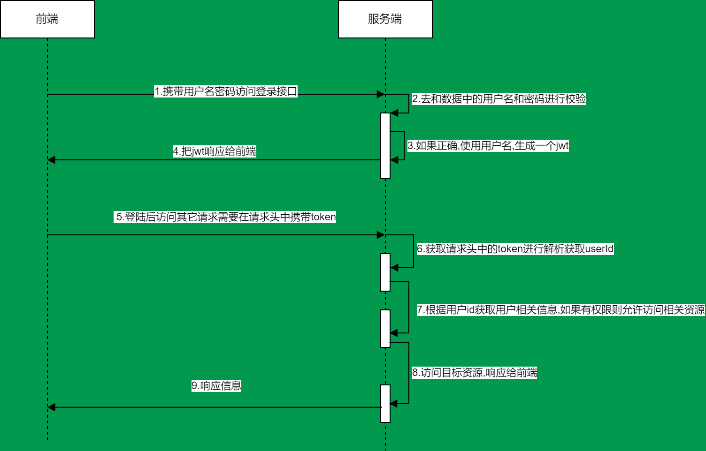

# 快速入门

## 1.1 准备工作

> 我们先搭建一个简单的SpringBoot工程
> > 1. 设置父工程 添加依赖
```xml
<parent>
    <groupId>org.springframework.boot</groupId>
    <artifactId>spring-boot-starter</artifactId>
    <version>2.5.0</version>
</parent>
<dependencies>
    <dependency>
        <groupId>org.springframework.boot</groupId>
        <artifactId>spring-boot-starter-web</artifactId>
    </dependency>
    <dependency>
        <groupId>org.projectlombok</groupId>
        <artifactId>lombok</artifactId>
    </dependency>
</dependencies>
```
## 引入SpringSecurity
> 在SpringBoot项目中使用SpringSecurity我们只需要引入依赖即可实现入门案例
```xml
<dependency>
    <groupId>org.springframework.boot</groupId>
    <artifactId>spring-boot-starter-security</artifactId>
</dependency>
```
> 引入以来后我们再尝试去访问之前的接口,就会自动跳转到一个SpringSecurity的默认登录页面,默认是user,密码会输出在控制台.
> 必须登录之后才能对接口进行访问
# 认证
## 2.1 登录校验流程

## 2.2 原理初探
> 想要知道如何实现自己的登录流程就必须要先知道入门案例中SpringSecurity的流程 SpringSecurity+JWT实现前后端分离认证
###  2.2.1 SpringSecurity 完整流程
> &nbsp;SpringSecurity 原理其实是一个过滤器链,内部包含了提供各种功能的过滤器.这里我们可以看看入门案例中的过滤器
> 
>

>  **UsernamePasswordAuthenticationFilter**:  负责处理我们在登陆页面填写了用户名密码后的登陆请求。入门案例的认证工作主要有它负责。  
>  **ExceptionTranslationFilter** :处理过滤器链中抛出的任何`AccessDeniedException`和`AuthenticationException`。    
> **FilterSecuritylnterceptor**:负责权限校验的过滤器。

> 我们可以查看SpringSecurity中的拦截器链


### 2.2.2 认证流程


>概念速查:
> >1. **Authentication接口**:它的实现类，表示当前访问系统的用户，封装了用户相关信息。  
> >2. **AuthenticationManager接口**:定义了认证Authentication的方法  
> >3. **UserDetailsService接口**:加载用户特定数据的核心接口。里面定义了一个根据用户名查询用户信息的方法。  
> >4. **UserDetails接口**:提供核心用户信息。通过userDetailService根据用户名获取处理的用户信息要封装成UserDetails对象返回。然后将这些信息封装到Authentication对象中。


## 2.3 解决问题
### 2.3.1 思路分析
> 登录
> > 1. **自定义接口**: 调用ProviderManager的方法进行认证,如果认证通过生成JWT,把用户信息存入Redis中
> > 2. 自定义UserDetailService这个实现类去查询数据库  

> 校验
> > 1. 定义JWT认证过滤器
> > > ①: 获取token  
> > > ②: 解析token获取其中的userId  
> >> ③: 从redis中获取用户信息  
> >> ④存入SecurityContextHolder

### 2.3.2 准备工作
```xml
<!--        redis依赖-->
<dependency>
    <groupId>org.springframework.boot</groupId>
    <artifactId>spring-boot-starter-data-redis</artifactId>
</dependency>
        <!--        fastJson-->
<dependency>
<groupId>com.alibaba</groupId>
<artifactId>fastjson</artifactId>
<version>1.2.33</version>
</dependency>
        <!--        jwt依赖-->
<dependency>
<groupId>io.jsonwebtoken</groupId>
<artifactId>jjwt</artifactId>
<version>0.9.0</version>
</dependency>
```
添加Redis相关配置
#### 2.3.3 实现
##### 2.3.3.1 数据库校验用户
> 1. UserServiceImpl.class 需要实现**UserDetailsService**接口,重写里面的`loadUserByUsername`方法,才能使用自己的数据库用户名密码登录
> 2. 重写该方法需要返回UserDetails对象,创建`CustomUserDetails`方法实现`UserDetails`方法,重写方法,并创建User对象作为该类的构造方法参数  
> 核心代码:   
> `service.UserServiceImpl.class`  `pojo.CustomUserDetails.class`
##### 2.3.3.2 密码加密存储
> 实际项目中我们不会把密码明文存储在数据库中。  
>1. 默认使用的PasswordEncoder要求数据库中的密码格式为: (id}password。它会根据id去判断密码的加密方式。但是我们一般不会采用这种方式。所以就需要替换PasswordEncoder  
>2. 我们一般使用SpringSecurity为我们提供的BCryptPasswordEncoder。  
>3. 我们只需要使用把BCryptPasswordEncoder对象注入Spring容器中，SpringSecurity就会使用该PasswordEncoder来进行密码校验.我们可以定义一个SpringSecurity的配置类，SpringSecurity要求这个配置类要继承WebSecurityConfigurerAdapter。
代码实现
>1. 创建`config.SecurityConfig.class`继承`WebSecurityConfigurerAdapter`,在该类中创建PasswordEncoder类型的Bean
##### 2.3.3.3 登录接口
>接下我们需要自定义登陆接口，然后让SpringSecurity对这个接口放行,让用户访问这个接口的时候不用登录也能访问。 
> 在接口中我们通过`AuthenticationManager的authenticate`方法来进行用户认证,所以需要在SecurityConfig中配置把`AuthenticationManager`注入容器。  
> 认证成功的话要生成一个jwt，放入响应中返回。并且为了让用户下回请求时能通过jwt识别出具体的是哪个用户，我们需要把用户信息存入redis，可以把`用户id作为key`。

核心代码

##### 2.3.3.4 认证过滤器
##### 2.3.3.5 退出登录
